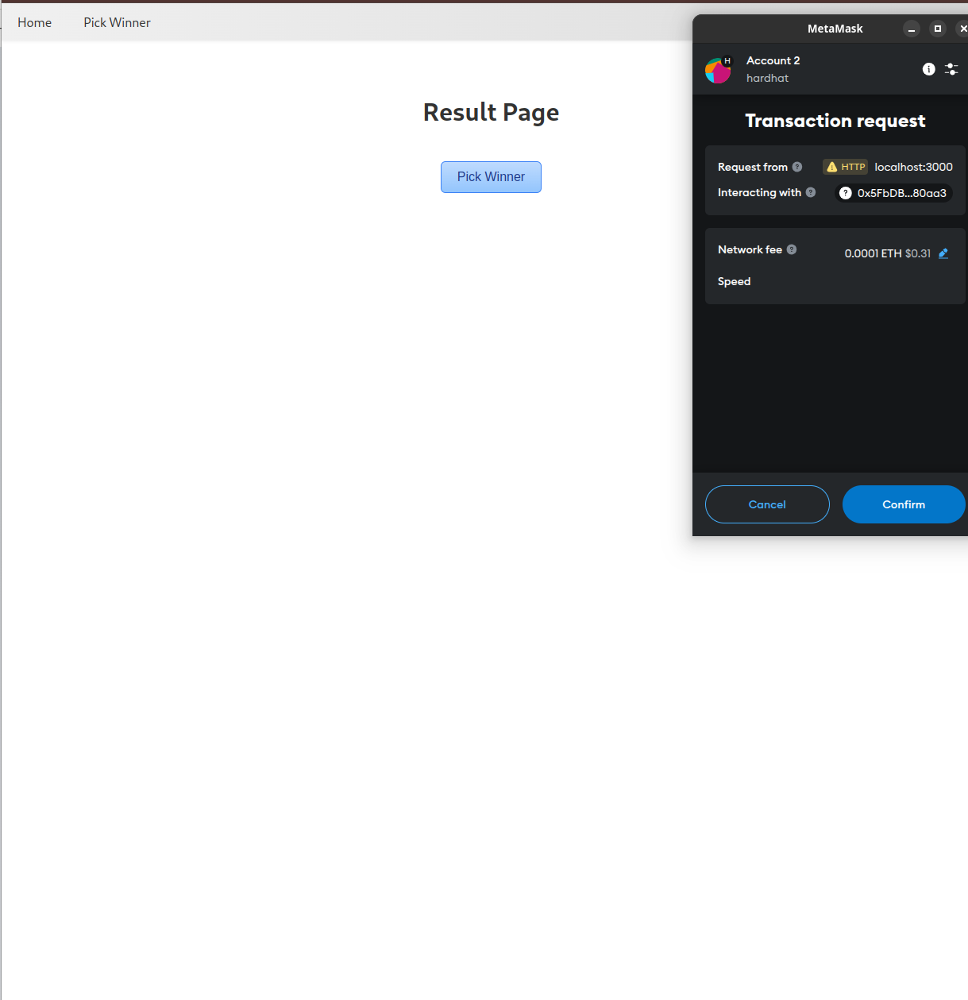

# User Manual

---

## Table of Contents

1. [Introduction](#1-introduction)
2. [Prerequisites](#2-prerequisites)
3. [Installation & Setup](#3-installation--setup)
4. [Using the Lottery DApp](#4-using-the-lottery-dapp)
    - [4.1 Home Page](#41-home-page)
    - [4.2 PickWinner Page](#42-pickwinner-page)
5. [Troubleshooting](#5-troubleshooting)
6. [Contact & Support](#6-contact--support)

---

## 1. Introduction

### What is the Lottery DApp?

The **Lottery DApp** is a decentralized application built on the Ethereum blockchain that allows users to participate in a lottery by sending a fixed amount of ETH (0.1 ETH). Participants enter the lottery, and a manager (the contract owner) can randomly pick a winner who will receive the entire pool of ETH collected from participants.

### Key Features

- **Decentralized Participation:** No central authority controls the lottery; it runs autonomously on the blockchain.
- **Transparency:** All transactions and participant entries are recorded on the blockchain, ensuring transparency.
- **Security:** Funds are securely managed by smart contracts, minimizing the risk of fraud.
- **User-Friendly Interface:** An intuitive React-based front end allows easy interaction with the lottery.

---

## 2. Prerequisites

Before using the Lottery DApp, ensure you have the following:

- **MetaMask Extension:**  
  MetaMask is a popular cryptocurrency wallet that allows you to interact with Ethereum-based DApps.  
  - **Installation:**  
    - [Install MetaMask](https://metamask.io/download.html) for your preferred browser (Chrome, Firefox, Brave, Edge).
  - **Setup:**  
    - Create a new wallet or import an existing one using your seed phrase.
    - Secure your wallet by safeguarding your seed phrase and setting a strong password.

- **Ether (ETH):**  
  To participate in the lottery, you need to have at least **0.1 ETH** in your MetaMask wallet.
  - **Obtaining ETH:**  
    - For testing purposes, you can use a local blockchain (Hardhat) with predefined accounts.

- **Basic Knowledge of Cryptocurrency Transactions:**  
  Familiarity with sending and receiving ETH, interacting with MetaMask, and understanding transaction confirmations.

---

## 3. Installation & Setup

Follow these steps to set up and deploy the Lottery DApp locally.

### 3.1 Clone the Repository

1. **Fork the Repository:**  
   If the project is hosted on GitHub, fork the repository to your own GitHub account.

2. **Clone the Repository Locally:**  
   Open your terminal or command prompt and run:
   ```bash
   git clone https://github.com/<your-username>/lottery-dapp.git
   cd lottery-dapp
   ```

### 3.2 Install Dependencies

Ensure you have **Node.js** installed (version 16+ recommended).

1. **Install Node.js:**  
   Download and install from [Node.js Official Website](https://nodejs.org/).

2. **Install Project Dependencies:**  
   Run the following command in the project root directory:
   ```bash
   npm install
   ```
   This command installs all necessary packages listed in `package.json`, including React, Ethers.js, and Hardhat.

### 3.3 Configure Hardhat

Hardhat is used for compiling, deploying, and testing smart contracts.

1. **Review `hardhat.config.js`:**  
   Ensure the configuration matches your intended network setup. A typical configuration for a local Hardhat network:
   ```javascript
   require("@nomicfoundation/hardhat-toolbox");

   module.exports = {
     solidity: "0.8.0",
     networks: {
       hardhat: {
         chainId: 31337,
         accounts: {
           mnemonic: "test test test test test test test test test test test junk",
           // count: 20 // optional
         }
       }
       // Add configurations for testnets like Goerli if needed
     }
   };
   ```

2. **Modify Network Settings (Optional):**  
   If deploying to a testnet, add the necessary network configurations, including API URLs and private keys.

### 3.4 Deploy the Smart Contract

Deploy the Lottery smart contract to your chosen network.

1. **Start a Local Hardhat Node (For Local Deployment):**  
   Open a new terminal window and run:
   ```bash
   npx hardhat node
   ```
   This command starts a local blockchain on `localhost:8545` with predefined accounts.

2. **Deploy the Contract:**  
   In another terminal window, run:
   ```bash
   npx hardhat run scripts/deploy.js --network localhost
   ```
   - **Output:**  
     The console will display the deployed contract address, e.g., `Lottery deployed to: 0x5FbDB2315678afecb367f032d93F642f64180aa3`.

3. **Update Contract Address in Front-End:**  
   Open `src/constants.js` and update the `contractAddress` with the newly deployed address:
   ```javascript
   const contractAddress = "0x5FbDB2315678afecb367f032d93F642f64180aa3";
   // ... rest of the code
   export default {
     contractAddress,
     contractAbi
   };
   ```

### 3.5 Configure MetaMask

1. **Import Accounts (For Local Deployment):**  
   - **Access the Mnemonic:**  
     Use the mnemonic defined in `hardhat.config.js` to import accounts into MetaMask.
   - **Add Accounts to MetaMask:**  
     - Open MetaMask and click on the account icon.
     - Select **Import Account** > **Import using Secret Recovery Phrase**.
     - Enter the mnemonic and complete the import process.

2. **Connect to the Correct Network:**  
   - **Local Network:**  
     - In MetaMask, click on the network dropdown and select **Localhost 8545** or add a new network with the following details:
       - **Network Name:** Hardhat Localhost
       - **RPC URL:** http://localhost:8545
       - **Chain ID:** 31337
       - **Currency Symbol:** ETH

### 3.6 Start the Front-End Application

1. **Run the React App:**  
   In the project root directory, execute:
   ```bash
   npm start
   ```
   - This command starts the React development server.
   - The app should automatically open in your default browser at [http://localhost:3000](http://localhost:3000).

2. **Verify Connection:**  
   - Ensure MetaMask is connected to the correct network.
   - Check that your account is displayed as connected in the DApp.

---

## 4. Using the Lottery DApp

Once the setup is complete, you can start interacting with the Lottery DApp.

### 4.1 Home Page

The **Home Page** serves as the main interface for users to enter the lottery or claim prizes.

#### Entering the Lottery

1. **Connect Your Wallet:**  
   - If not already connected, MetaMask will prompt you to connect your wallet when you access the DApp.
   - Approve the connection in the MetaMask popup.

2. **Enter Lottery:**  
   - On the Home Page, click the **"Enter Lottery"** button.
   - A MetaMask transaction popup will appear requesting to send **0.1 ETH**.
   - **Confirm the Transaction:**  
     - Review the transaction details and confirm.
   - **Transaction Confirmation:**  
     - Wait for the transaction to be mined.
     - Upon success, your address will be added to the list of players.

3. **Feedback:**  
   - After entering, the UI may update to show your entry or provide a success message.

#### Claiming the Prize

1. **Winning the Lottery:**  
   - After the manager picks a winner, if your address is selected, you will see a **"Claim Prize"** button.

2. **Claim Prize:**  

   - Click the **"Claim Prize"** button.
   - A MetaMask transaction popup will appear requesting to transfer the prize to your wallet.
   - **Confirm the Transaction:**  
     - Review the transaction details and confirm.
   - **Transaction Confirmation:**  
     - Wait for the transaction to be mined.
     - Upon success, the prize (ETH balance) will be transferred to your account.

3. **Feedback:**  
   - After claiming, the UI will indicate that the prize has been successfully claimed or update the status accordingly.

### 4.2 PickWinner Page

The **PickWinner Page** is restricted to the contract manager (owner) and allows them to select a winner from the pool of participants.

#### Picking a Winner

1. **Connect as Manager:**  
   - Ensure you are connected to MetaMask with the manager account (the account that deployed the contract).

2. **Access PickWinner Page:**  
   - Click on the **"PickWinner"** link in the navigation menu or navigate to `/PickWinner`.

3. **Pick Winner:**  
   - On the PickWinner Page, click the **"Pick Winner"** button.
   - A MetaMask transaction popup will appear requesting to execute the `pickWinner` function.
   - **Confirm the Transaction:**  
     - Review the transaction details and confirm.
   - **Transaction Confirmation:**  
     - Wait for the transaction to be mined.
     - Upon success, a winner will be selected, and the lottery status will be marked as complete.

4. **Feedback:**  
   - The UI will display the winner's address.
   - If you are not the manager, the page will display **"You are not the owner."**

---

## 5. Troubleshooting

Encounter issues while using the Lottery DApp? Here are some common problems and solutions.

### 5.1 Cannot Enter the Lottery

**Possible Causes:**

- **Insufficient ETH Balance:**  
  Ensure your MetaMask account has at least **0.1 ETH**.
  
- **Incorrect Network Selection:**  
  Verify that MetaMask is connected to the correct network (Localhost 8545 or the designated testnet).

- **Contract Already Complete:**  
  The lottery may have already been completed. Check the lottery status on the Home Page.

**Solutions:**

1. **Check ETH Balance:**  
   - Open MetaMask and verify your account balance.
   - If insufficient, acquire more ETH from a faucet or another source.

2. **Verify Network:**  
   - In MetaMask, click the network dropdown and select the appropriate network.
   - If necessary, add a new network with the correct RPC URL and Chain ID.

3. **Check Lottery Status:**  
   - If the lottery is complete, you cannot enter again until a new round is started.

### 5.2 Pick Winner Button Not Visible

**Possible Causes:**

- **Not Connected as Manager:**  
  Only the contract manager can see and interact with the **"Pick Winner"** button.

- **Lottery Already Complete:**  
  If the lottery is already complete, the button may be disabled or hidden.

**Solutions:**

1. **Ensure Manager Account:**  
   - Confirm that MetaMask is connected with the manager account (the account that deployed the contract).
   - If not, switch to the manager account in MetaMask.

2. **Verify Lottery Status:**  
   - Check if the lottery is already marked as complete on the Home Page.
   - If so, a new lottery round must be initiated by redeploying the contract or implementing a reset mechanism.

### 5.3 Claim Prize Not Working

**Possible Causes:**

- **Not the Winner:**  
  Only the selected winner can claim the prize.

- **Lottery Not Complete:**  
  The lottery must be complete before claiming the prize.

- **Transaction Reverts:**  
  Possible issues with gas limits or network connectivity.

**Solutions:**

1. **Confirm Winner Status:**  
   - Ensure that your address is the selected winner.
   - The **"Claim Prize"** button will only appear if you are the winner.

2. **Verify Lottery Completion:**  
   - Check the lottery status on the Home Page.
   - If the lottery is not complete, wait until the manager picks a winner.

3. **Check Transaction Details:**  
   - If a transaction reverts, review the error message in MetaMask.
   - Ensure you have sufficient gas and are connected to the correct network.

### 5.4 MetaMask Issues

**Possible Causes:**

- **Connection Problems:**  
  MetaMask may not be connected to the DApp.

- **Network Mismatch:**  
  MetaMask is connected to a different network than the DApp.

**Solutions:**

1. **Reconnect MetaMask:**  
   - Refresh the DApp page.
   - If prompted, reconnect your MetaMask wallet.

2. **Switch Networks:**  
   - In MetaMask, click the network dropdown and select the correct network.
   - Add the network if it’s not listed.

3. **Restart MetaMask:**  
   - Close and reopen the MetaMask extension.
   - Restart your browser if necessary.
---

## 6. Contact & Support

If you encounter issues not covered in the troubleshooting section or need further assistance, please reach out through the following channels:

- **GitHub Issues:**  
  [Open an Issue](https://github.com/<your-username>/lottery-dapp/issues) on the GitHub repository to report bugs or request features.
---

## Summary

This user manual provides comprehensive instructions for setting up, deploying, and using the Lottery DApp. By following the steps outlined above, users can easily participate in the lottery, manage entries, and claim prizes securely and efficiently. For any further assistance, refer to the troubleshooting section or contact support through the provided channels.
